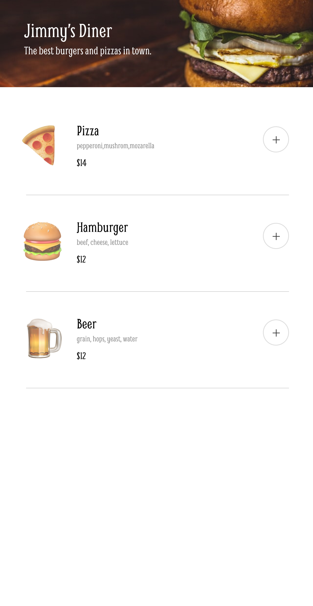
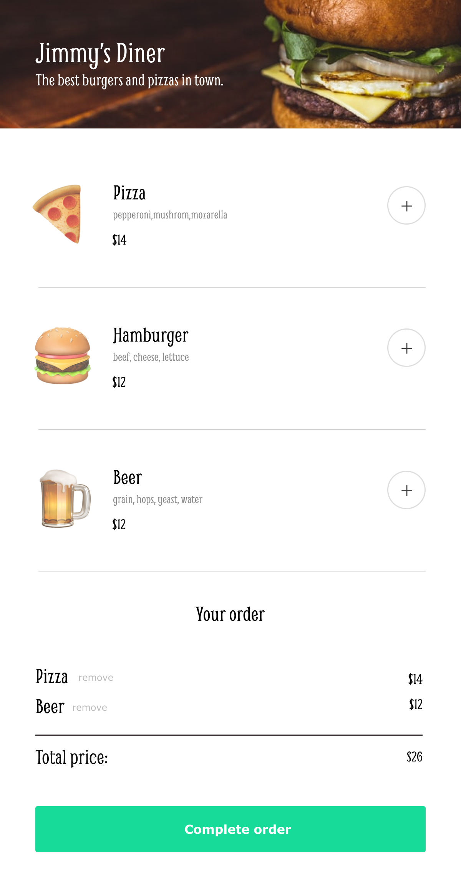

# scrimba-restaurant
Restaurant project for scrimba

## Design
This app allows users to see food items on a menu: 

Users can then add items to their order: 

When the order is complete, users are prompted to enter their payment information: 

Finally, users are notified that their order is on its way. 

## Requirements
- Render menu options via JS
- Be able to add and remove items from order
- Payment modal with required/validated inputs (CC checksum)
- Meal discount
- User rating via stars